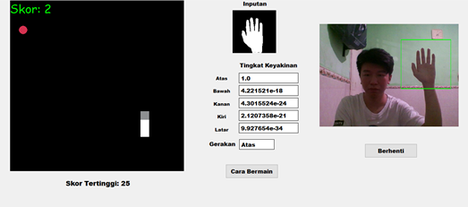

# Hand Gesture Recognition Snake Control 🐍✋



A Python-based computer vision project that enables real-time control of a Snake game using hand gestures captured via webcam. This project combines classic gameplay with modern gesture recognition technology using Convolutional Neural Networks (CNN) for an engaging, hands-free gaming experience.

## 🚀 Features

- **Real-time Gesture Control**: Control the Snake game using intuitive hand gestures
- **CNN-Powered Recognition**: Advanced gesture detection using Convolutional Neural Networks
- **Computer Vision Processing**: Utilizes OpenCV for robust video capture and image processing
- **Automated Input**: PyAutoGUI integration for seamless keyboard simulation
- **Plug-and-Play**: No additional hardware required - works with any standard webcam
- **Customizable Settings**: Configurable game parameters and gesture sensitivity

## 🛠️ Tech Stack

| Technology | Purpose |
|------------|---------|
| **Python** | Core application logic and project foundation |
| **OpenCV** | Real-time video capture and computer vision processing |
| **PyAutoGUI** | Keyboard automation for game control simulation |
| **Pygame** | Snake game framework and graphics rendering |
| **NumPy** | Numerical computations for image processing |
| **TensorFlow/Keras** | CNN model implementation for gesture classification |

## 📋 Prerequisites

- Python 3.7 or higher
- Webcam (built-in or external)
- Operating System: Windows, macOS, or Linux

## ⚡ Installation & Setup

### 1. Clone the Repository
```bash
git clone https://github.com/jamesjasz/HGRforControlSnake.git
cd HGRforControlSnake
```

### 2. Install Dependencies
```bash
pip install -r requirements.txt
```

### 3. Verify Installation
Ensure your webcam is connected and accessible by your system.

## 🎮 Usage Instructions

### Running the Application

1. **Start Gesture Recognition Module**:
   ```bash
   python coba10c.py
   ```

2. **Launch Snake Game**:
   ```bash
   python SnakeFun.py
   ```

3. **Position Yourself**: 
   - Sit approximately 2-3 feet from your webcam
   - Ensure good lighting conditions
   - Keep your hand clearly visible in the camera frame

4. **Control Gestures**:
   - **Up**: Raise your hand upward
   - **Down**: Move your hand downward
   - **Left**: Move your hand to the left
   - **Right**: Move your hand to the right

## 🧠 How It Works

### Gesture Recognition Pipeline

1. **Video Capture**: OpenCV captures real-time video frames from the webcam
2. **Preprocessing**: Images are processed using HSV color-space filtering for hand detection
3. **Contour Detection**: Advanced contour analysis identifies hand shapes and movements
4. **CNN Classification**: Trained Convolutional Neural Network classifies detected gestures
5. **Input Simulation**: PyAutoGUI translates recognized gestures into keyboard commands
6. **Game Control**: Snake game responds to simulated keystrokes in real-time

### Technical Implementation

The system employs computer vision techniques including:
- HSV color space conversion for robust hand detection
- Morphological operations for noise reduction
- Contour analysis for gesture boundary detection
- Deep learning classification for accurate gesture recognition

## 📁 Project Structure

```
HGRforControlSnake/
├── README.md                    # Project documentation
├── requirements.txt             # Python dependencies
├── image.png                   # Project demonstration image
├── coba10c.py                  # Main gesture recognition module
├── coba10c_page23.py          # Alternative/testing version
├── SnakeFun.py                # Pygame-based Snake game
├── settingsSnakeFun.py        # Game configuration parameters
└── Artikel Ilmiah...pdf       # Research documentation
```

## ⚙️ Configuration

### Game Settings
Modify `settingsSnakeFun.py` to customize:
- Game speed and difficulty
- Snake appearance and colors
- Game board dimensions
- Scoring system parameters

### Gesture Sensitivity
Adjust gesture recognition parameters in the main module:
- Detection threshold values
- Gesture recognition confidence levels
- Camera calibration settings

---

⭐ **Star this repository if you found it helpful!** ⭐
